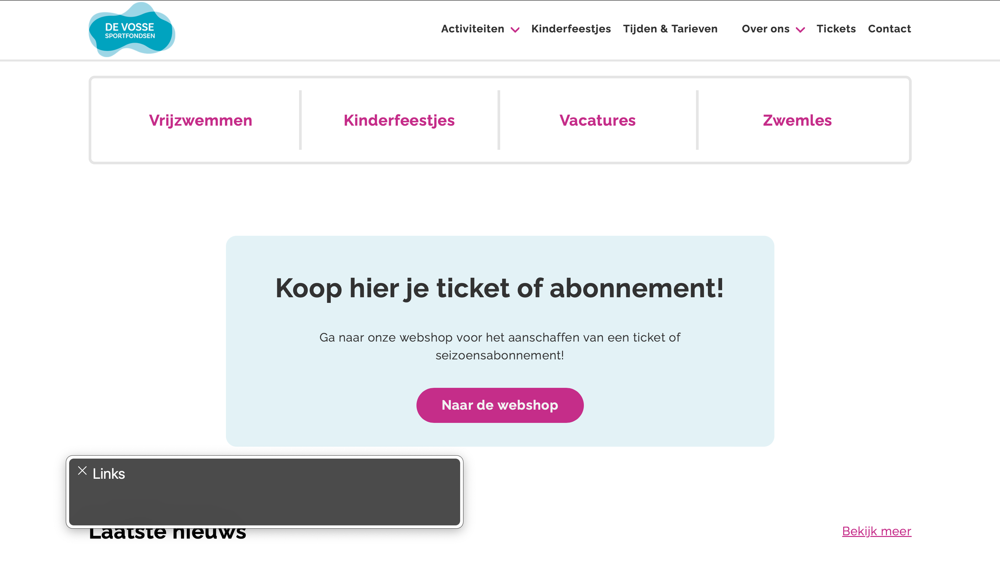
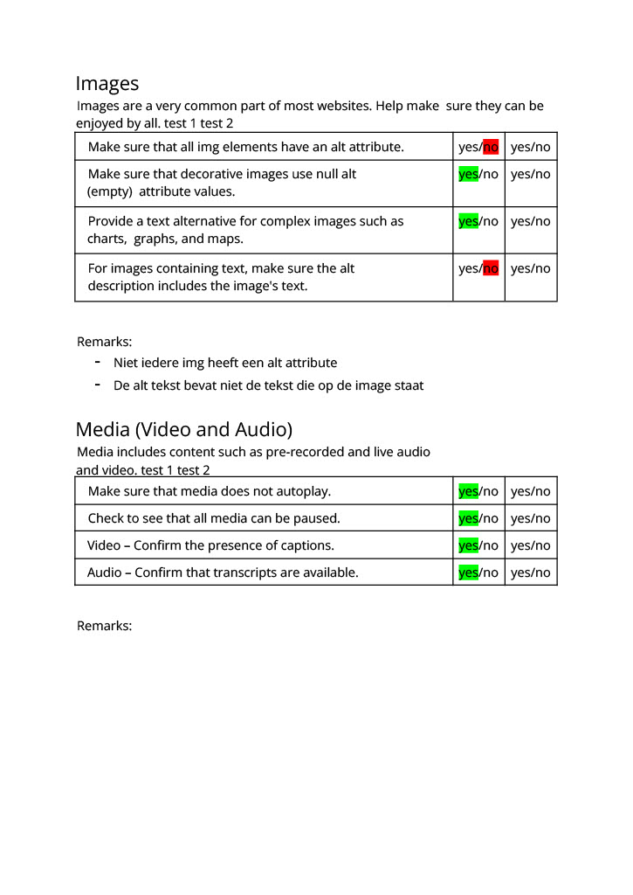
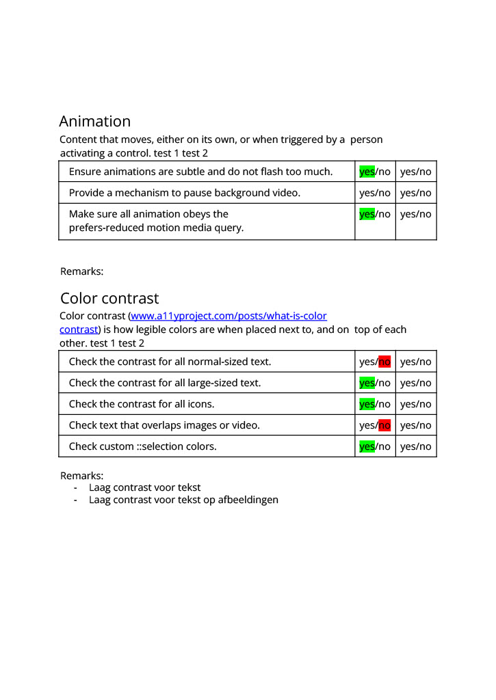

Markdown is een simpele manier om HTML te schrijven.  
Markdown cheat cheet: [Hulp bij het schrijven van Markdown](https://github.com/adam-p/markdown-here/wiki/Markdown-Cheatsheet).

Nb. De standaardstructuur en de spartaanse opmaak van de README.md zijn helemaal prima. Het gaat om de inhoud van je procesverslag. Besteedt de tijd voor pracht en praal aan je website.

Nb. Door *open* toe te voegen aan een *details* element kun je deze standaard open zetten. Fijn om dat steeds voor de relevante stuk(ken) te doen.

## Jij

  
uitwerken voor kick-off werkgroep

  ### Auteur:
  Jesse Kaptein

  #### Je startniveau:
  Rood

  #### Je focus:
  Responsive Design
 

## Je website

  
uitwerken voor kick-off werkgroep

  ### Je opdracht:
  https://www.devosse.nl

  #### Screenshot(s) van de eerste pagina (small screen): 
  Informatie pagina over het vrijzwemmen
  

  #### Screenshot(s) van de tweede pagina (small screen):
  Winkel waar de gebruiker online een ticket of abonnement kan kopen
  
 

## Toegankelijkheidstest 1/2 (week 1)

  
uitwerken na test in 2e werkgroep

  ### Bevindingen
  Lijst met je bevindingen die in de test naar voren kwamen:
  
  

  <ul>
    <li>Headings worden correct voorgelezen op de website</li>
    <li>Afbeeldingen hebben geen goede alt tekst</li>
    <li>Links op de website worden correct voorgelezen</li>
    <li>Aantal knoppen werden niet gevonden of voorgelezen</li>
    <li>De webshop is lastig te gebruiken op de telefoon</li>
    <li>Links zijn niet altijd duidelijk waar ze naar toe gaan</li>
  </ul>

  
  
  
  
  
  
  

## Breakdownschets (week 1)

  
uitwerken na afloop 3e werkgroep

  ### de hele pagina: 
  

  ### dynamisch deel (bijv menu): 
  

## Voortgang 1 (week 2)

  
uitwerken voor 1e voortgang

  ### Stand van zaken
  hier dit ging goed & dit was lastig (neem ook screenshots op van delen van je website en code)
  Wat ging goed:
  <ul>
    <li>Het doorwerken aan mijn code ging lekker, ik zat in een goede werkflow.</li>
    <li>Ik heb goede stappen gemaakt in mijn werk.</li>
    <li>Mijn HTML en CSS zien er goed uit.</li>
  </ul>

  Wat ging minder goed:
  <ul>
    <li>Het positioneren van items vind ik soms nog wat lastig om ze exact op de juiste plek te krijgen.</li>
  </ul>

  
  

  ### Agenda voor meeting
  samen met je groepje opstellen

  | Jesse (ik)              | student 2          | student 3    | student 4        |
  | ---                    | ---                | ---          | ---              |
  | Ik zou graag feedback
  willen op mijn code en
  of deze er een beetje 
  goed uitziet.                | en dit             | en ik dit    | en dan ik dat    |
  |                        | dit als er tijd is | nog een punt | dit wil ik zeker |
  | ...                     | ...                | ...          | ...              |

  ### Verslag van meeting
  hier na afloop snel de uitkomsten van de meeting vastleggen

  - HTML en CSS zien er beide goed uit.
  - Goed gebruik van custom properties.
  - Iets meer focus op accessibility.

## Voortgang 2 (week 3)

  
uitwerken voor 2e voortgang

  ### Stand van zaken
  hier dit ging goed & dit was lastig (neem ook screenshots op van delen van je website en code)

  <ul>
    <li>Ik ben een behoorlijk stuk verder gekomen met mijn code en lig lekker op schema.</li>
    <li>Ik merk dat ik steeds beter wordt in het positioneren van items.</li>
    <li>Mijn HTML en CSS zien er nog steeds goed uit. Zelfs na alle toevoegingen.</li>
  </ul>

  Wat ging minder goed:
  <ul>
    <li>Nog niet helemaal de focus op accessibility zoals ik zou willen. Dit moet ik later nog toevoegen.</li>
  </ul>

  
  

  ### Agenda voor meeting
  samen met je groepje opstellen

  | Jesse (ik)                 | student 2          | student 3    | student 4        |
  | ---                    | ---                | ---          | ---              |
  | Ikzelf had voor deze 
  sessie geen vragen.      | en dit             | en ik dit    | en dan ik dat    |
  |                         | dit als er tijd is | nog een punt | dit wil ik zeker |
  | ...                      | ...                | ...          | ...              |

  ### Verslag van meeting
  hier na afloop snel de uitkomsten van de meeting vastleggen

  - HTML en CSS zien er nog steeds erg goed en netjes uit.
  - Vergeet het werk niet op Github te zetten.

## Toegankelijkheidstest 2/2 (week 4)

  
uitwerken na test in 9e werkgroep

  ### Bevindingen
  Lijst met je bevindingen die in de test naar voren kwamen (geef ook aan wat er verbeterd is):

   
   
   
   
   
   
   

   Wat is er verbeterd:
   <ul>
    <li>Het contrast op de artikelen is enorm verbeterd.</li>
    <li>Op het vlak van accessibility zijn er ook enorm veel dingen verbeterd.</li>
    <li>Ik gebruik headings die bepaalde elementen van de pagina introduceren.</li>
   </ul>

## Voortgang 3 (week 4)

  
uitwerken voor 3e voortgang

  ### Stand van zaken
  hier dit ging goed & dit was lastig (neem ook screenshots op van delen van je website en code)

  <ul>
    <li>Mijn HTML en CSS is 99% af. Ik hoef het alleen nog maar een beetje te tweaken.</li>
    <li>Responsiveness gaat ook goed, hoef nog maar een paar kleine dingetjes aan te passsen.</li>
    <li>De screenleader leest de meeste dingen correct voor, ik moet daar nog wel iets bij aanpassen.</li>
  </ul>

  Wat ging minder goed:
  <ul>
    <li>
    Ik ben nog niet helemaal tevreden over het navigatiemenu. Ik gebruik nu buttons voor 2 elementen waarbij ik liever iets anders
    zou willen gebruiken.
    </li>
  </ul>

  ### Agenda voor meeting
  samen met je groepje opstellen

  | Jesse (ik)                    | student 2          | student 3    | student 4        |
  | ---                         | ---                | ---          | ---              |
  | Ik wil graag nog voor een
  laatste keer feedback krijgen
  op mijn HTML en CSS.            | en dit             | en ik dit    | en dan ik dat    |
  |              | dit als er tijd is | nog een punt | dit wil ik zeker |
  | ...                       | ...                | ...          | ...              |

  ### Verslag van meeting
  hier na afloop snel de uitkomsten van de meeting vastleggen

  - Mijn code ziet er nog steeds goed uit.
  - Mensen waren positief over hoe de accessibility is verbeterd.

## Eindgesprek (week 5)

  
uitwerken voor eindgesprek

  ### Je uitkomst - karakteristiek screenshots:
  

  ### Dit ging goed/Heb ik geleerd: 
  Korte omschrijving met plaatjes

  
  
Ik ben tevreden met dat de header responsive is, zowel op mobiel als laptop.

  
   
Ik ben tevreden met het hamburgermenu wat ook echt werkt.

  
  
Ik ben erg blij dat de slider knoppen het doen onder de artikelen.

  
   
Deze grid is automatisch responsief en daar ben ik erg tevreden mee.

  ### Dit was lastig/Is niet gelukt:
  Korte omschrijving met plaatjes

  
   
Ik ben niet helemaal tevreden met dat ik buttons heb gebruikt in mijn header om het uitklapmenu te maken. Ik had eerst
   anchors gebruikt maar dat werkte niet goed samen met de screenreader. Daarnaast worden de menu items ook niet automatisch voorgelezen door
   de screenreader. Daarnaast heb ik nog geprobeerd om de menu's automatisch dicht te laten klappen maar dit is helaas ook niet gelukt.

## Bronnenlijst

  
continu bijhouden terwijl je werkt

  Nb. Wees specifiek ('css-tricks' als bron is bijv. niet specifiek genoeg). 
  Nb. ChatGpT en andere AI horen er ook bij.
  Nb. Vermeld de bronnen ook in je code.

  1. ChatGPT
  2. https://css-tricks.com/inclusively-hidden/
  3. https://developer.mozilla.org/en-US/docs/Web/Accessibility/ARIA/Attributes/aria-label
  4. https://developer.mozilla.org/en-US/docs/Web/Accessibility/ARIA/Attributes

